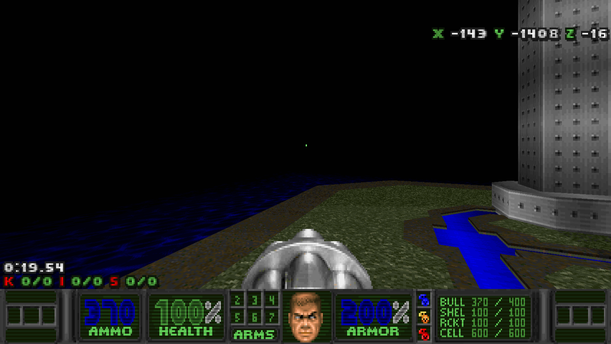
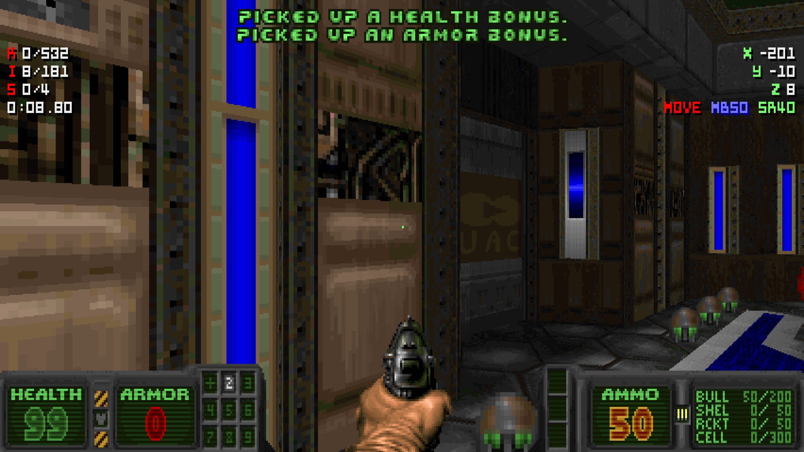
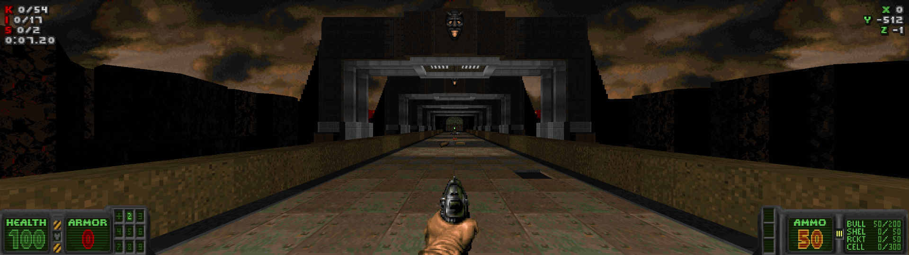

# UAC Tactical HUD by DRON12261

# STATUS: ✅RELEASED

UAC Tactical HUD is a HUD built on the NUGHUD for Nugget Doom and Cherry Doom. It also features the classic STATUSBAR, allowing it to run on all other ports, but with the classic look.

What this HUD offers:
- Beautiful stylization with green monitors with scanlines
- Support for ultra widescreen monitors (maybe)
- Extended ARMS widget that allows you to see the presence of berserk, chainsaw and super shotgun separately
- Additional armor icon that displays the type of armor carried
- Additional ammo icon showing the type of ammo for the current weapon
- Adaptation to all Nugget Doom and Cherry Doom text widgets, including movement widget and minimap widget

### Download - [Latest Release](https://github.com/dron12261games/MOD-UAC-Tactical-HUD/releases/download/v1/UAC.Tactical.HUD.v1.by.DRON12261.wad)

# CREDITS
**Created by DRON12261**

Based on old material by Giffy

# Screenshots:

